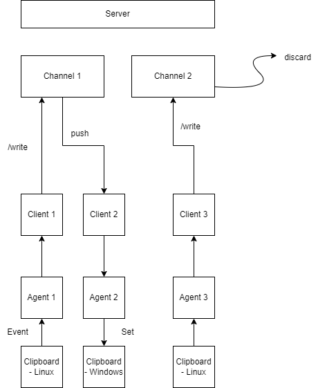

# SCSP
SCSP is going to be written in rust



## Server
SCSP server has a volatile pub/sub mechanism that broadcasts message to all listeners on a given channel.

## Client
SCSP client can either register listeners on server or publish message to some channel.

## Agent
SCSP agent sends and consumes message via client. It also syncs message from/to clipboard. 

# Start SCSP

`TODO: add command line arguments`

## Start server
```bash
cargo run --package=scsp-server --bin=server
```
### Server args
```
--port -p: port number
```


## Start agent

```bash
cargo run --package=scsp-agent --bin=agent
```